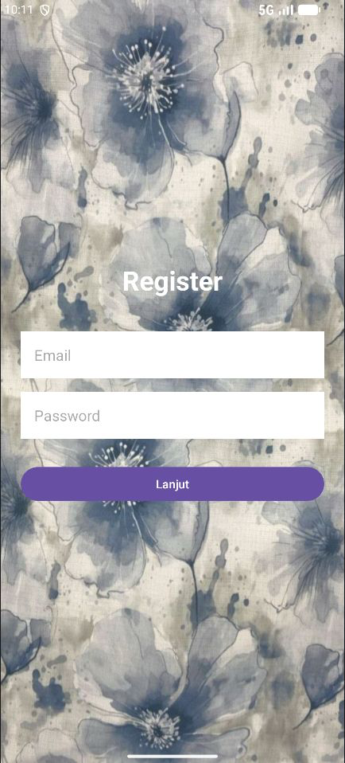
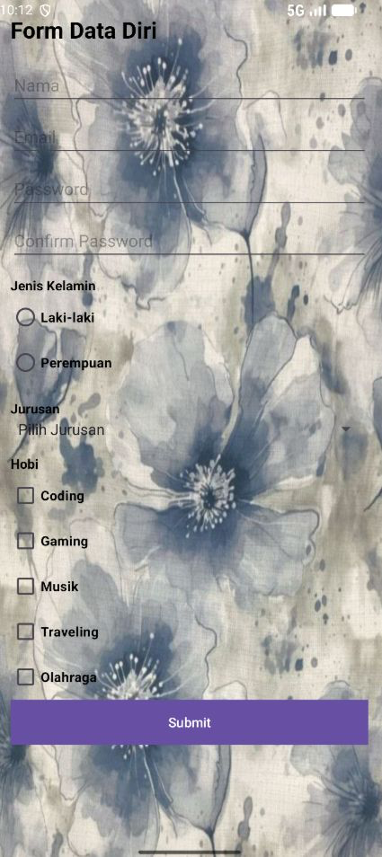

# RegisterApp2

A two-screen user registration Android application built with Kotlin.

## Overview

RegisterApp2 implements a multi-step registration flow:

1. **Login Screen (MainActivity)** — email and password entry with validation
2. **Registration Form (FormActivity)** — detailed personal info collection with a summary dialog on submit

## Tech Stack

- **Language**: Kotlin
- **Platform**: Android (minSdk 31, targetSdk 36)
- **UI**: AppCompat + Material Design 3
- **Build**: Gradle 9.2.1 with Kotlin DSL, AGP 9.0.1

## Features

- Email format validation and password match verification
- Text inputs, radio buttons (gender), spinner (major), and checkboxes (hobbies)
- AlertDialog summary of collected registration data
- Toast feedback in Indonesian
- ScrollView layout for long-form content
- Day/night theme support

## Project Structure

```
app/src/main/
├── java/com/example/registerapp/
│   ├── MainActivity.kt       # Login screen
│   └── FormActivity.kt       # Registration form screen
└── res/
    ├── layout/
    │   ├── activity_main.xml
    │   └── activity_form.xml
    └── values/
        ├── strings.xml
        ├── colors.xml
        └── themes.xml
```

## Building

```bash
./gradlew build
```

Or open the project in Android Studio and run directly on a device or emulator (API 31+).

## Requirements

- Android Studio Ladybug or newer
- Android SDK API 31+
- JDK 11

## Screenshot


